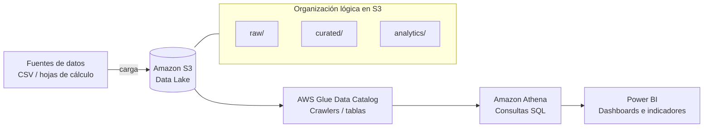

# Data Warehouse Serverless en AWS para Análisis de Compras — MAGHSA, S.A.

Trabajo de Graduación — Ingeniería en Sistemas de Información y Ciencias de la Computación (UMG)
Autor: David Edgar Recinos García

## Objetivo

Construir y evaluar una arquitectura de Data Warehouse serverless en AWS orientada al análisis
de compras de Máquinas Agroindustriales MAGHSA, S.A., basada en S3, Glue Data Catalog y Athena,
con dashboards de indicadores en Power BI, priorizando simplicidad operativa y bajo costo de
mantenimiento.

## Arquitectura



Flujo de cuatro capas desacopladas: **almacenamiento (S3) → metadatos (Glue Data Catalog) →
cómputo/consulta (Athena) → presentación (Power BI)**. Cada capa se puede escalar o reemplazar
de forma independiente sin afectar al resto de la solución.

## Stack

| Componente | Rol |
|---|---|
| Amazon S3 | Almacenamiento de datasets analíticos (Data Lake) |
| AWS Glue Data Catalog | Repositorio de metadatos: bases, tablas, particiones, crawlers |
| Amazon Athena | Motor de consultas SQL serverless sobre S3 |
| Power BI Desktop | Modelado semántico y dashboards de KPIs |
| Formatos | CSV (raw) → Parquet (curated/analytics) |

## Estructura del repositorio

```
/modelo-dimensional/   → DDL de hechos y dimensiones (esquema estrella)
/s3-structure/          → Organización de prefijos/zonas en S3
/glue/                  → Definición de crawler y tablas del Data Catalog
/athena/queries/        → Consultas SQL de los KPIs de compras
/sample-data/           → Dataset sintético de prueba (no son datos reales de MAGHSA)
/docs/                  → Evidencia del avance (capturas, resultados)
```

## Modelo dimensional (resumen)

Esquema estrella orientado a análisis de compras:

- **Hechos:** `hechos_compras` — una fila por línea de orden de compra
- **Dimensiones:** `dim_tiempo`, `dim_proveedor`, `dim_producto`, `dim_categoria`

Ver detalle en [`/modelo-dimensional/`](./modelo-dimensional).

## Alcance

Este repositorio documenta la parte técnica del alcance definido en el documento de tesis:
definición del modelo dimensional, organización lógica en S3, catalogación en Glue Data Catalog,
consultas analíticas en Athena y validación funcional del flujo de extremo a extremo. Quedan
fuera del alcance: implementación empresarial a gran escala, ingesta en tiempo real, pipelines de
transformación complejos y automatización avanzada.

## Estado del avance

- [x] Problema y requerimientos definidos (documento de tesis)
- [x] Arquitectura de la solución
- [x] Modelo dimensional (hechos y dimensiones)
- [ ] Carga de dataset de prueba en S3
- [ ] Catalogación en Glue Data Catalog
- [ ] Consultas de validación en Athena
- [ ] Dashboards en Power BI
