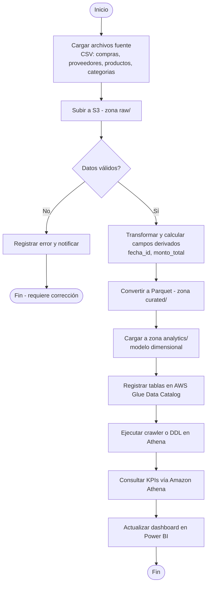

# Diagrama de proceso (equivalente a actividad UML)

Flujo del proceso de extremo a extremo, desde la carga del archivo fuente hasta el consumo del
dato en el dashboard de Power BI.

Ver la organización de zonas en S3 en [`/s3-structure/`](../s3-structure) y la definición de
tablas en [`/glue/`](../glue).
